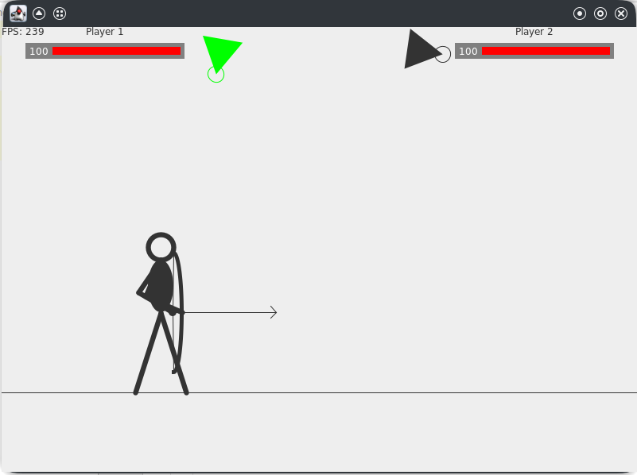
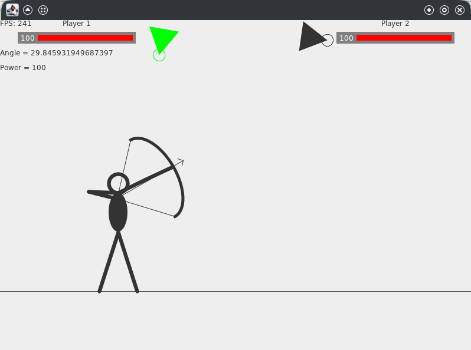

# Archer game
Archer shooting game. 2 players controlled by the user take turns to shoot each other.
The first player to reach 0 health will lose.

features
- Fast rendering by separating update and render routines into two threads.
- Used Swing Canvas for low level rendering, which increase rendering speed.
- Usage of advanced algorithms like Inverse kinematics for arm movements.
- Well separated classes for easier management and portability.

### screenshots
Idle archer

Firing archer

### notes
Any ideas or issues are welcomed in pull requests and issues sections